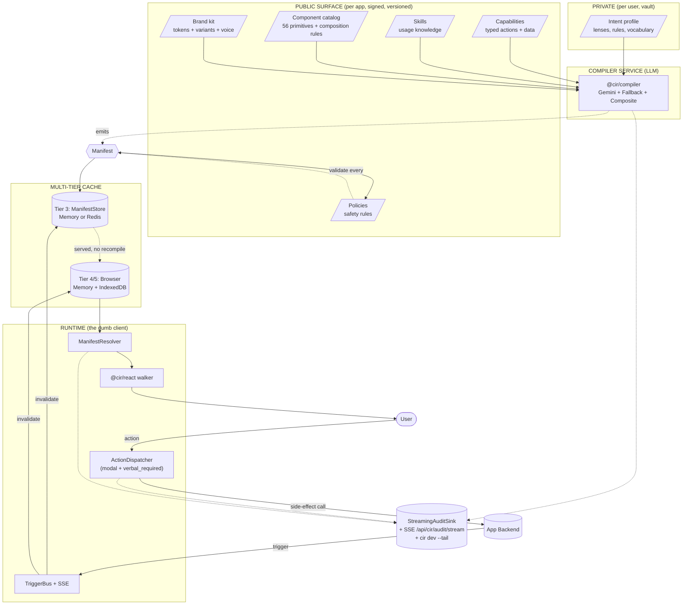
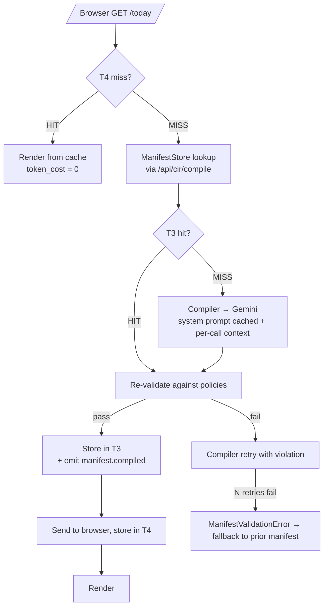

# CIR

**Capability · Intent · Render** — a production architecture for dynamic software interfaces.

> **Capabilities and skills are the public artifact.**
> **Intent is the private artifact.**
> **UI is ephemeral output.**

Software ships **capabilities and skills** (typed actions, data, usage knowledge). Users keep **intent** (preferences, lenses, rules). Agents emit **UI as ephemeral output** — a `Manifest` JSON document that the runtime renders. Cached. Versioned. Recomputed only on trigger.

CIR is the integration of pieces that already exist — MCP-style capabilities, skills, JSON manifest UI, intent profiles, multi-tier caching, pub-sub triggers — into one principled architecture. Compile rarely, render constantly. **The interface is not the product. The capability is.**

---

## Quick start (10 minutes from `git clone` to a personalised UI)

```bash
git clone https://github.com/fragmatic-io/cir.git
cd cir
pnpm install                                              # ≈ 60s

# (Optional) drop your Gemini API key into apps/demo/.env.local for LLM
# compile; without a key, the FallbackCompiler runs and the demo still
# boots end-to-end.
cp apps/demo/.env.local.example apps/demo/.env.local      # seeds sane defaults

pnpm demo                                                 # boots vault + Next.js together
# vault: http://localhost:4001  (consent UI lives here)
# demo:  http://localhost:3000  (lands on /onboarding for a clean profile)
```

`pnpm demo` is the orchestration script — it spawns `cir vault dev` (the
intent vault server) and `next dev` (the demo app) with prefixed log
streams, sets `NEXT_PUBLIC_VAULT_URL` automatically, and tears both down
on Ctrl-C. First-boot path: **`/onboarding` → vault consent UI → token
minted → `/today` rendered with intent-honoured manifest.**

Three demos ship in `apps/`:

- **`apps/demo`** — the personalisation showcase (LLM-assisted onboarding,
  intent profile editing, dark mode toggle, optimistic UI, undo toasts).
- **`apps/demo-dummyjson`** — e-commerce catalog with lens-switching
  (compact / cozy / spacious), bulk cart actions, hover-card product
  previews.
- **`apps/demo-github`** — real-mutations issue queue with optimistic
  archive, undo within 5s, hierarchy treatment for assigned-to-me, hover
  cards on `#issue` references.

Each is bootable individually with `pnpm --filter @cir/demo-<name> dev`,
or via `pnpm demo --app <name>` once the vault is running.

Developer CLI — same `cir` entry point you'll use in your own apps:

```bash
pnpm cir --help                                    # top-level usage
pnpm cir init my-app                               # scaffold a new CIR app
pnpm cir compile fixtures/intent.json \            # offline compile to a manifest
  --capabilities capabilities/ \
  --components components/registry.json
pnpm cir inspect manifests/m_xyz.json              # pretty-print a manifest tree
pnpm cir dev --tail                                # spawn next dev + tail audit SSE
pnpm cir import openapi spec.yaml                  # generate draft capabilities
pnpm cir add Button                                # copy a baseline component into ./components/
pnpm cir components-sync                           # regen registry.json from @cir/components
pnpm cir validate                                  # run the host validate chain
```

See [`packages/cli/README.md`](packages/cli/README.md) for the full subcommand surface and the flags (`--strict`, `--tail`, `--tail-only`, `--audit-url`, `--no-color`, `--json`, `--server`).

---

## Architecture



Five public artifacts at the top, signed and versioned by the app. Private intent below them belongs to the user. The compiler is the only LLM-touching component. Every manifest passes the policy engine before serving. Once cached, nothing in the hot path is non-deterministic — render is a pure function of `(manifest, data)`.



Cost: 1 LLM call on cold path (~5–20k tokens). Zero LLM calls on the hot path. Triggers (capability bumped, intent changed, component removed, user-requested recompile) are the only things that invalidate.

---

## Packages

| Package             | One-liner                                                                                                                                                                                                                                                                        |
| ------------------- | -------------------------------------------------------------------------------------------------------------------------------------------------------------------------------------------------------------------------------------------------------------------------------- |
| `@cir/schemas`      | Zod schemas + JSON Schema codegen for every CIR artifact (Capability, Skill, Component, Manifest, Trigger, Intent, Audit, BrandKit, Policy, CompositionRules). [README](packages/schemas/README.md).                                                                             |
| `@cir/policies`     | 7 baseline pure-function validators + `PolicyRegistry` for app-supplied custom policies + `BehavioralPatternDetector` interface. [README](packages/policies/README.md).                                                                                                          |
| `@cir/runtime`      | Framework-agnostic core: manifest cache (Memory + IndexedDB), fetcher, resolver, action dispatcher (modal + verbal-phrase confirm + LRU undo), trigger bus + SSE transport, render-plan builder, audit sinks (incl. `StreamingAuditSink`). [README](packages/runtime/README.md). |
| `@cir/components`   | 56 baseline React primitives (Layout, Display, Input, Navigation, Feedback, Action, Specialized) with composition rules + per-component metadata. [README](packages/components/README.md).                                                                                       |
| `@cir/react`        | React adapter: `<CirRuntime>` provider, `<CirRoute>` walker, hooks, confirmation portal, SWR + optimistic UI, `@cir/react/debug` subpath for the floating audit panel. [README](packages/react/README.md).                                                                       |
| `@cir/compiler`     | LLM-backed compile service: `GeminiCompiler` + `FallbackCompiler` + `CompositeCompiler`, `compileIntentProfile()` for LLM-assisted onboarding, `MemoryManifestStore` + `RedisManifestStore`, `ServerManifestResolver`. [README](packages/compiler/README.md).                    |
| `@cir/evals`        | Eval harness, `defineEval()`, `cir-evals` CLI. End-to-end Gemini smoke + nightly workflow. [README](packages/evals/README.md).                                                                                                                                                   |
| `@cir/cli`          | Unified developer CLI: `cir init / dev / add / components-sync / validate / import openapi / inspect / compile / vault dev`, with `--tail` for terminal-side audit observability. [README](packages/cli/README.md).                                                              |
| `@cir/vault-server` | The reference intent vault server. `node:http` + ed25519 JWTs + JSON-file storage. Mints scoped tokens, enforces scope-based read/write filtering, emits `system.security_revocation` triggers. [README](packages/vault-server/README.md).                                       |
| `@cir/vault-client` | Typed wire client for the vault. Local JWKS-cached signature verification, pluggable token storage (browser localStorage + in-memory + custom), typed errors for clean fall-through. [README](packages/vault-client/README.md).                                                  |

---

## Vault

CIR's vault — the user-owned store apps request scoped read access to — ships in two packages:

- **`@cir/vault-server`** — Reference vault server. `node:http` + ed25519 JWT signing + JSON-file storage by default. Run with `pnpm cir vault dev --port 4001`.
- **`@cir/vault-client`** — Typed wire client. The demo's `apps/demo/lib/intent-store.ts` swapped from `localStorage` to this client (Wave 7 / track V-1). On vault unreachable, the demo falls back to `localStorage` with a console warning. Production hosts disable the fallback via `NEXT_PUBLIC_VAULT_FALLBACK=disabled`.

The wire format — endpoints, scope grammar, JWT claims, key rotation, revocation propagation — lives in [`docs/vault-protocol.md`](docs/vault-protocol.md).

```bash
# 1. Boot the vault.
pnpm cir vault dev --port 4001

# 2. Run the demo. NEXT_PUBLIC_VAULT_URL points at the vault by default.
pnpm --filter @cir/demo dev
# → http://localhost:3000
```

The two packages plug into the existing trigger bus via `system.security_revocation`: when a user revokes a grant, every running runtime that subscribes to triggers invalidates the affected manifests. The bus is the host's choice (in-memory, SSE, Redis); the vault doesn't care.

---

## What's shipped

```mermaid
graph TB
  subgraph Shipped["Shipped (verifiable in this commit)"]
    direction TB
    S1["56 baseline components<br/>+ composition rules JSON sibling"]
    S2["7 baseline policies<br/>+ PolicyRegistry for app-defined"]
    S3["LLM compiler<br/>Gemini + Fallback + Composite"]
    S4["StreamingAuditSink<br/>+ IndexedDB cache + SSE transport"]
    S5["Public artifacts<br/>capabilities/ skills/ recipes/ policies/<br/>+ .well-known/cir.json"]
    S6["_review envelope<br/>+ validate-data --strict CI gate<br/>for OpenAPI imports"]
    S7["LLM-assisted onboarding<br/>compileIntentProfile + /onboarding/describe<br/>+ /onboarding/review human gate"]
    S8["8-subcommand cir CLI<br/>incl. cir inspect / compile / dev --tail"]
    S9["Nightly Gemini eval workflow<br/>auth-fail vs no-key distinction"]
    S10["984 tests across 136 files<br/>15 schema-validated artifact files"]
  end

  subgraph Roadmap["Roadmap / not yet shipped"]
    direction TB
    R3["Behavioral pattern detector implementations<br/>(interface only)"]
    R4["Audit sink server endpoint in the demo<br/>(cir dev --tail is a contract)"]
    R5["Marketplace / community recipes"]
    R6["Live-query subscriptions<br/>(SWR + optimistic UI cover the common cases)"]
    R7["Cross-app workflow compilation"]
    R8["Mobile + native render runtimes"]
  end
```



---

## Run the demo end-to-end

```bash
pnpm --filter @cir/demo dev
# → http://localhost:3000
```

First visit lands on `/onboarding`. Two paths:

1. **Checkbox grant** — list of lens scopes, Grant all / Customize / Deny.
2. **"Or describe yourself in your own words →"** — `/onboarding/describe` POSTs free text to `/api/cir/onboarding/compile`, which calls `compileIntentProfile()` (Gemini, deterministic fallback). The user then **reviews and edits** the draft `IntentProfile` on `/onboarding/review` before saving. The free-text description is request-scoped — never logged, never persisted.

Once granted, `/today` loads. Open DevTools console for audit events. Try:

- Click any thread → `/thread/{id}` with sanitized markdown.
- Click **Archive** → modal confirmation (`confirmation: 'modal'`).
- Click **↶ Undo** → action dispatcher pops the LRU undo stack.
- Visit `/settings/intent` → revoke per-lens or revoke all.
- The intent profile carries `global_preferences.color_mode` (`light`,
  `dark`, or `system`). `<CirRoute>` mirrors it onto
  `<html data-color-mode>` and every component ships paired light + `dark:`
  Tailwind utilities (Wave 7c / Vis-2) — the demo's Tailwind config keys
  off `[data-color-mode="dark"]` so the theme switches automatically when
  the LLM-onboarding flow infers a dark preference. See
  [`packages/components/README.md`](packages/components/README.md) §"Dark
  mode" for the per-component pairing reference.
- Trigger an SSE recompile from another shell:
  ```bash
  curl -XPOST http://localhost:3000/api/triggers/publish \
    -H 'content-type: application/json' \
    -d '{"type":"user.recompile_route","user_id":"demo-user","manifest_id":"m_demo_today","route":"/today"}'
  ```
  Browser refetches via SSE.

In a second terminal:

```bash
pnpm cir dev --tail-only
# tails /api/cir/audit/stream — every compile / policy fail / action.executed
```

See [`apps/demo/README.md`](apps/demo/README.md) for what's wired and how to swap in a real compiler (Gemini / Anthropic / Claude Code CLI / Codex CLI).

---

## Verifying the whole thing

```bash
pnpm validate                 # license + typecheck + lint + format + components:check + validate-data + tests
pnpm validate:fast            # everything except tests (pre-push hook)
pnpm test                     # vitest (984 tests across 136 files at this commit)
pnpm test:coverage            # detailed coverage by package
pnpm exec cir-schemas dump --out .well-known/schemas      # regenerate published JSON Schemas
pnpm exec cir-schemas validate-data --strict              # fail on _review drafts
pnpm exec cir-evals run                                   # eval suite
pnpm exec cir-evals run --tag smoke                       # Gemini end-to-end smoke (skips without key)
pnpm exec cir-evals run --tag chain                       # personalisation chain integration witness (offline-first, deterministic)
pnpm --filter @cir/demo build                             # Next.js production build
pnpm --filter @cir/demo e2e                               # Playwright (requires `e2e:install` first)
```

The nightly Gemini job runs at `.github/workflows/nightly-evals.yml` against the `GEMINI_API_KEY` repo secret. PR CI skips it; nightly catches drift. If the key is revoked or invalid, the eval surfaces `auth_failed: true` and the workflow exits non-zero — silent skip on a revoked key would be a regression, not a pass.

---

## Repo layout

```
cir/
├── ETHOS.md                    # The ten principles
├── AGENTS.md                   # Coding-agent instructions
├── README.md                   # ← this file
├── docs/                       # framework chapters + chat/voice/agent extensions
├── packages/                   # pnpm workspace (8 published packages)
├── apps/demo/                  # Next.js 15 end-to-end showcase
├── capabilities/               # typed action+data definitions (with _review envelope)
├── skills/                     # markdown skills with YAML frontmatter
├── components/                 # registry.json + composition-rules.json (synced from @cir/components)
├── policies/                   # app-defined declarative policies (JSON, PolicySchema)
├── recipes/                    # default manifests per persona
├── evals/                      # *.eval.ts scenarios, incl. nightly Gemini smoke
├── .well-known/
│   ├── cir.json                # public discovery manifest
│   └── schemas/                # generated JSON Schemas (versioned)
└── scripts/                    # check-license-headers, sync-component-registry, sanity test
```

---

## Where to read next

| You want to                               | Read                                                         |
| ----------------------------------------- | ------------------------------------------------------------ |
| Understand the philosophy                 | [`ETHOS.md`](ETHOS.md) — 10 principles                       |
| Understand the architecture               | [`docs/architecture.md`](docs/architecture.md)               |
| Understand caching + invalidation         | [`docs/caching.md`](docs/caching.md)                         |
| Understand triggers                       | [`docs/triggers.md`](docs/triggers.md)                       |
| Understand cost economics                 | [`docs/token-economics.md`](docs/token-economics.md)         |
| Understand the component catalog          | [`docs/component-catalog.md`](docs/component-catalog.md)     |
| Understand chat / voice / agent surfaces  | [`docs/chat/overview.md`](docs/chat/overview.md)             |
| See how the framework was built (history) | [`docs/build-plan.md`](docs/build-plan.md)                   |
| Operate it in production                  | [`docs/production-concerns.md`](docs/production-concerns.md) |
| Build something on this repo              | [`AGENTS.md`](AGENTS.md)                                     |
| See it run                                | [`apps/demo/README.md`](apps/demo/README.md)                 |
| Help out                                  | [`CONTRIBUTING.md`](CONTRIBUTING.md)                         |

---

## The bet

The next decade of software is built on **capability surfaces** and **ephemeral interfaces**, with users (or agents acting for them) composing what they actually need from a stable substrate. Get the three artifacts right (capability is contract, intent is private, UI is ephemeral) and 90% of software's flexibility problems collapse into one architecture.

The interface is not the product. The capability is.
