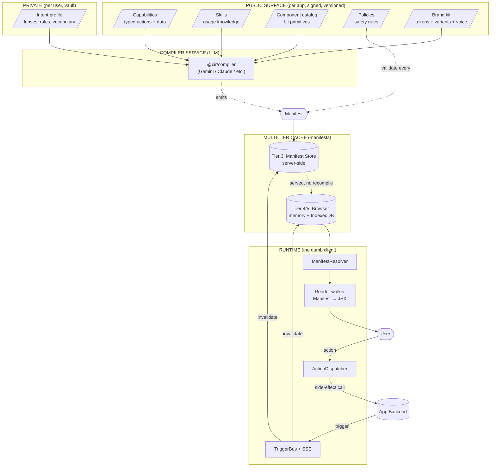
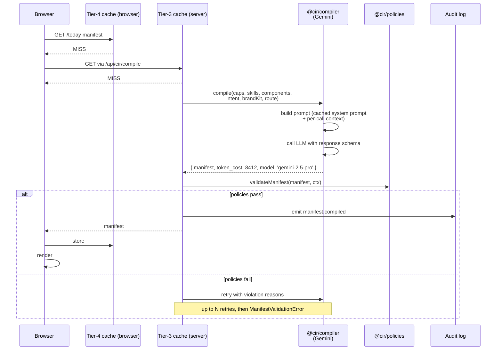
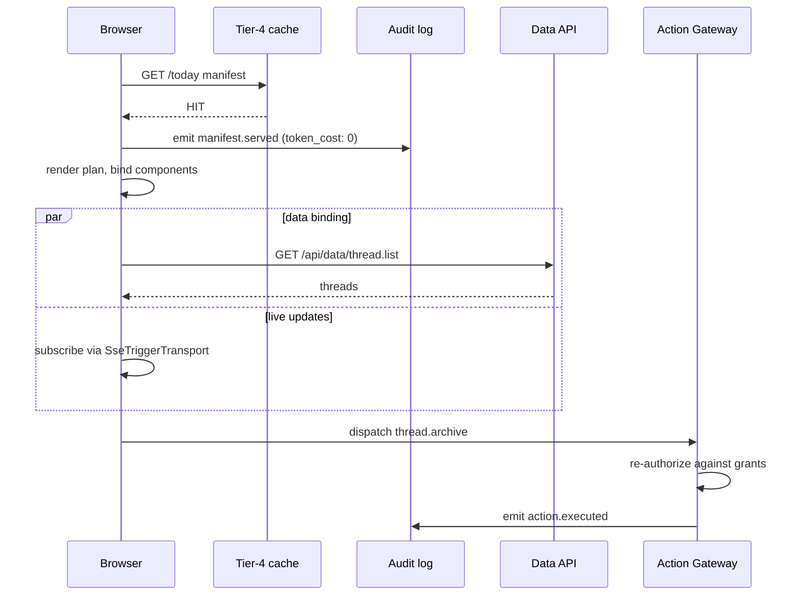
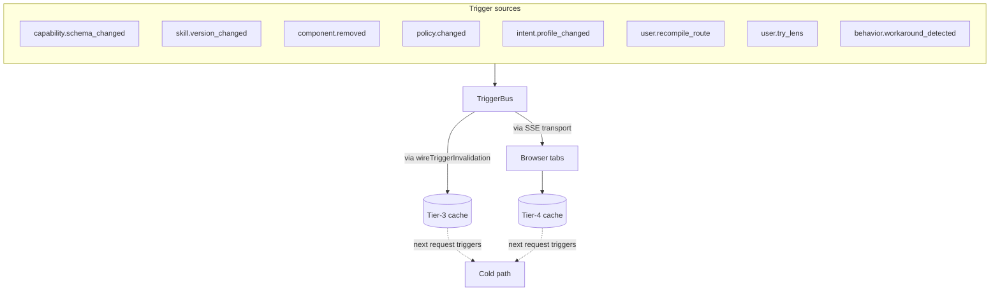
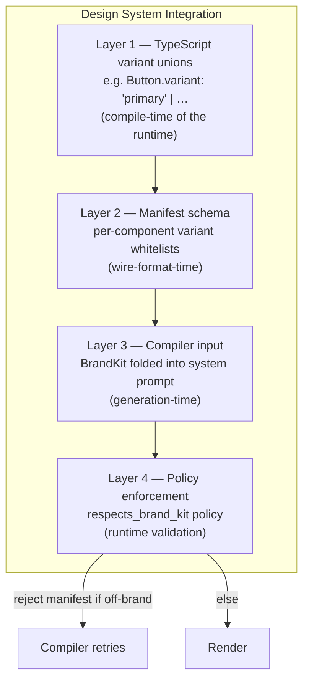
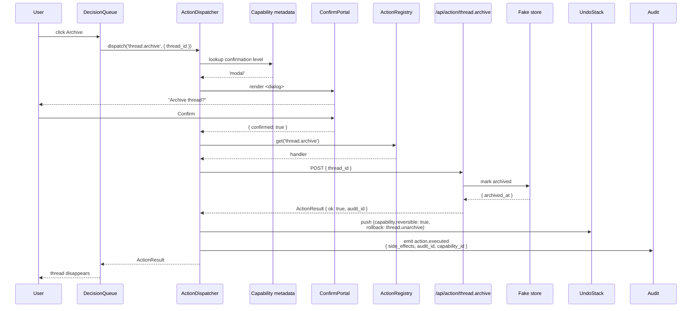

# CIR

**Capability · Intent · Render** — a production architecture for dynamic software interfaces.

> **Capabilities and skills are the public artifact.**
> **Intent is the private artifact.**
> **UI is ephemeral output.**

Software ships **capabilities and skills** (typed actions, data, usage knowledge). Users keep **intent** (preferences, lenses, rules). Agents emit **UI as ephemeral output** — a `Manifest` document that the runtime renders. Cached. Versioned. Recomputed only on trigger.

The interface is not the product. The capability is.

---

## TL;DR — the one-paragraph version

A CIR app's UI is a **JSON document** (the manifest), not a React tree. The manifest comes from a **compiler service** (LLM-backed in production) that reads the user's intent profile and produces a layout from typed primitives. A **policy engine** validates every manifest before render — destructive actions need confirmation, PII can't leak into URLs, reversible actions need undo affordances. The result lives in a **multi-tier cache** that only invalidates when a **trigger** fires (capability schema bumped, user changed lens, etc.). The render runtime is dumb on purpose — it binds data to components and dispatches actions, nothing more.

```
ship capabilities → users carry intent → manifests are ephemeral
```

---

## Quick links

|                  |                                                                               |
| ---------------- | ----------------------------------------------------------------------------- |
| **Read**         | [`ETHOS.md`](ETHOS.md) — the ten principles                                   |
| **Build on**     | [`AGENTS.md`](AGENTS.md) — instructions for coding agents                     |
| **Deep docs**    | [`docs/`](docs/) — 14 chapters covering architecture, caching, triggers, etc. |
| **Chat surface** | [`docs/chat/`](docs/chat/) — agents, voice, multi-modal extensions            |
| **Demo**         | [`apps/demo/README.md`](apps/demo/README.md) — runnable Next.js demo          |
| **Phase status** | [Phase status](#phase-status--whats-shipped)                                  |

---

## Architecture at a glance



The five public artifacts at the top are signed and versioned by the app. The private intent below them belongs to the user. The compiler is the only LLM-touching component. Once a manifest is produced, **nothing in the hot path is non-deterministic** — render is a pure function of `(manifest, data)`.

---

## How a request flows

### Cold path — first time, or after a trigger evicted the cache



Cost: 1 LLM call. Token cost: ~5–20k for a cold compile. Recorded as a `manifest.compiled` audit event with `token_cost`, `compiler_model`, `compiled_at`.

### Hot path — every subsequent visit



**Zero LLM calls on the hot path.** The expensive part happens once per `(user, app, route, intent_v, capability_v, …)` combination.

### Triggers — the only thing that invalidates



The full `trigger → invalidation` matrix is in [`docs/caching.md`](docs/caching.md). The runtime ships `wireTriggerInvalidation()` which wires every trigger type to the right eviction predicate.

---

## The layers — what each one is and how to verify it

| #   | Layer                   | Package           | What it owns                                                                                                                                                                                                                                                                                                                                                  | How to verify it works                                                                                                                       |
| --- | ----------------------- | ----------------- | ------------------------------------------------------------------------------------------------------------------------------------------------------------------------------------------------------------------------------------------------------------------------------------------------------------------------------------------------------------- | -------------------------------------------------------------------------------------------------------------------------------------------- |
| 1   | **Schemas**             | `@cir/schemas`    | Zod schemas + types for every CIR artifact (Capability, Skill, Component, Manifest, Trigger, Intent, Audit, BrandKit). Single source of truth for the wire format.                                                                                                                                                                                            | `pnpm --filter @cir/schemas test` (46 tests, 100% coverage). `pnpm exec cir-schemas dump` produces 13 JSON Schemas in `.well-known/schemas/` |
| 2   | **Policies**            | `@cir/policies`   | 7 baseline validators (`data_access_within_grant`, `confirmation_required_for_destructive`, `no_pii_in_query_strings`, `rate_limited_actions_show_state`, `reversibility_surfaced`, `respects_brand_kit`, `composes_according_to_rules`). `BehavioralPatternDetector` interface and a `PolicyRegistry` for app-supplied custom policies.                      | `pnpm --filter @cir/policies test`. Or: violate a policy in the demo's manifest and watch the resolver throw `ManifestValidationError`       |
| 3   | **Evals**               | `@cir/evals`      | Eval harness (the framework, not the evals). `defineEval()` + `cir-evals run` CLI for end-to-end scenario tests.                                                                                                                                                                                                                                              | `pnpm exec cir-evals run` (1 example eval passes)                                                                                            |
| 4   | **Runtime**             | `@cir/runtime`    | Framework-agnostic core: `MemoryManifestCache` + `IndexedDBManifestCache` (byte-aware LRU), `ManifestFetcher` (retry/backoff/ETag), `ManifestResolver`, `ActionDispatcher` (validate → confirm → execute → undo), `TriggerSubscription` interface, `InMemoryTriggerBus`, `SseTriggerTransport`, `wireTriggerInvalidation()`, `buildRenderPlan()`, `AuditSink` | `pnpm --filter @cir/runtime test` (102 tests). Or: open the demo, watch DevTools Console for audit events                                    |
| 5   | **Components**          | `@cir/components` | 56 baseline React components covering Layout (8), Display (12), Input (12), Navigation (6), Feedback (6), Action (4), and Specialized (8). Sanitized Markdown via react-markdown + rehype-sanitize. `data-cir-component` selectors for theming. RSC-friendly — only the few components that need DOM state ship `'use client'`.                               | `pnpm --filter @cir/components test`. Or: import them in any React app                                                                       |
| 6   | **React adapter**       | `@cir/react`      | `<CirRuntime>` provider, `<CirRoute path>` walker, hooks (`useCir`, `useManifest`, `useDispatcher`, `useTrigger`), `ConfirmPortal`, `<CirErrorBoundary>`, `DataResolver` protocol, stale-while-revalidate + optimistic UI primitives. Every file that uses hooks ships `'use client'` for Next.js App Router compat.                                          | `pnpm --filter @cir/react test`                                                                                                              |
| 7   | **Compiler**            | `@cir/compiler`   | LLM-backed manifest producer. Gemini integration, prompt builder, response validation, server-side `ManifestStore` (Tier 3 — `MemoryManifestStore` and `RedisManifestStore`), trigger-driven invalidation, `FallbackCompiler` for hand-written manifests when no API key.                                                                                     | run with `GEMINI_API_KEY` set; check `manifest.compiled` audit events show `compiler_model: 'gemini-2.5-pro'` and `token_cost > 0`           |
| 8   | **Demo (email triage)** | `apps/demo`       | Next.js 15 App Router app exercising every layer end-to-end. Domain components (DecisionQueue/TaskQueue/ThreadView/UndoBar) on top of the 56-component baseline. Tailwind 4 + `data-cir-component` styling.                                                                                                                                                   | `pnpm --filter @cir/demo dev` → http://localhost:3000/today                                                                                  |

---

## The four design-system layers

This is how an app stays on-brand even when the LLM is generating layouts:



`@cir/schemas` exports a `BrandKit` type: tokens (colors, spacing, typography, motion, radius, shadow), per-component variant enums, and voice guidelines (tone + do/don't lists). The compiler folds this into its cached system prompt; the runtime's policy engine checks every produced manifest against it. Detail in [`docs/component-catalog.md`](docs/component-catalog.md) and the `BrandKit` schema source.

---

## Phase status — what's shipped

| Phase      | Status     | Commit    | What landed                                                                                                                                                                                                                                             |
| ---------- | ---------- | --------- | ------------------------------------------------------------------------------------------------------------------------------------------------------------------------------------------------------------------------------------------------------- |
| **1**      | ✅ shipped | `29ea072` | Production-grade repo skeleton: TS strict, ESLint 9 flat, Prettier, Vitest, Husky, commitlint, GitHub Actions CI, MIT license, 33 docs                                                                                                                  |
| **2**      | ✅ shipped | `3018243` | `@cir/schemas` (Zod + JSON Schema codegen), validate-data CLI, license-header check, actionlint, coverage thresholds                                                                                                                                    |
| **3**      | ✅ shipped | `75ad088` | `@cir/policies` (baseline validators + composer + behavioral interface), `@cir/evals` (harness + CLI), commitlint GitHub Action, `pnpm validate:fast`                                                                                                   |
| **4a**     | ✅ shipped | `df53c47` | `@cir/runtime` framework-agnostic core: manifest cache, fetcher, resolver, action dispatcher, trigger bus, registries, render plan                                                                                                                      |
| **4b**     | ✅ shipped | `cd974b4` | `@cir/components` (13-component starter set) + `@cir/react` (provider, hooks, walker, confirm portal). Next.js App Router compatible (`'use client'` everywhere needed)                                                                                 |
| **4c**     | ✅ shipped | `03b0b99` | `apps/demo` Next.js 15 demo with email-triage scenario, fake compiler, real runtime/policies/dispatcher                                                                                                                                                 |
| **4d**     | ✅ shipped | `e79254a` | Sanitized markdown (react-markdown + rehype-sanitize), IDB byte-size accounting, SSE trigger transport, ThreadView, Playwright smoke tests                                                                                                              |
| **4d-fix** | ✅ shipped | `b5a43a1` | UndoBar component to satisfy `reversibility_surfaced` policy in the demo                                                                                                                                                                                |
| **5a**     | ✅ shipped | `4183edd` | `@cir/compiler` real source: Gemini integration, prompt builder, server-side `ManifestStore` (Tier 3), `BrandKit` in `@cir/schemas`, `respects_brand_kit` policy, `<DebugPanel>` + `<CompileBadge>` UI, `/api/cir/*` route handlers, `FallbackCompiler` |
| **5b**     | ✅ shipped | `1f6615f` | Skill parser, `PolicyRegistry` for app-supplied custom policies, stale-while-revalidate + optimistic UI primitives in `@cir/react`, `composes_according_to_rules` policy                                                                                |
| **5c**     | ✅ shipped | `e4dcae2` | `verbal_required` confirmation (voice phrase match) wired through `ConfirmPortal`, `RedisManifestStore` for multi-instance Tier-3, +10 components, +10 evals, MIT relicense (Apache-2.0 → MIT)                                                          |
| **5d**     | ✅ shipped | `6730feb` | `@cir/components` baseline complete: batches 2–5 ship the remaining 43 primitives so the catalog matches the 56-component spec in `docs/component-catalog.md`. Composition rules updated for every new primitive.                                       |
| **5e**     | 📋 planned | —         | `apps/demo-dummyjson` and `apps/demo-github` skeletons (lens-switching showcase, real-mutations showcase), Playwright for both new demos, deployment notes, root README finalized                                                                       |

**Cumulative numbers (post-5d):** 7 packages · 56-component baseline · 7 baseline policies · `pnpm validate` exits 0.

---

## Run the email-triage demo

```bash
git clone git@github.com:fragmatic-io/cir.git
cd cir
pnpm install
pnpm --filter @cir/demo dev
# → http://localhost:3000/today
```

Open DevTools → Console to watch audit events. Try:

0. **First visit** → `/` redirects to `/onboarding`, the permission-grant screen for the lens slices this app needs (`lens.today`, `lens.thread`, `vocabulary.read`). Grant or customize → app proceeds; deny → dead-end stub. Visit `/settings/intent` to see granted lenses and revoke them. Demo-only `localStorage` profile under key `cir.demo.intent`; see `apps/demo/README.md` § "First-run onboarding".
1. **Click any thread** → navigates to `/thread/{id}` with sanitized markdown bodies (GFM tables, strikethrough)
2. **Click Archive** → confirmation `<dialog>` opens (capability has `confirmation: 'modal'`)
3. **Click ↶ Undo** (bottom right) → pops the dispatcher's undo stack and dispatches the rollback
4. **Trigger an SSE recompile from another shell:**
   ```bash
   curl -XPOST http://localhost:3000/api/triggers/publish \
     -H 'content-type: application/json' \
     -d '{"type":"user.recompile_route","user_id":"demo-user","manifest_id":"m_demo_today","route":"/today"}'
   ```
   Page auto-refetches via SSE → cache invalidates → re-renders.

See [`apps/demo/README.md`](apps/demo/README.md) for what's wired and how to swap in a real compiler (Gemini / Claude Code CLI / Codex CLI / Anthropic SDK).

---

## How does it actually work? Walk through one click

You click **Archive** on a thread:



Every step here is a typed contract enforced by code:

- `confirmation: 'modal'` is a [`Capability`](packages/schemas/src/capability.ts) field
- The policy engine refuses to compile a manifest that uses `thread.archive` without a confirmation gate
- The undo stack and `rollback: 'thread.unarchive'` are required by the `reversibility_surfaced` policy
- The audit event has typed `side_effects` and shows up in your audit log forever

---

## Repo layout

```
cir/
├── ETHOS.md                    # The ten principles
├── AGENTS.md                   # Coding-agent instructions
├── README.md                   # ← this file
├── docs/                       # 14 framework chapters + chat/voice/agent extensions
├── packages/                   # pnpm workspace
│   ├── schemas/                #   @cir/schemas
│   ├── policies/               #   @cir/policies
│   ├── evals/                  #   @cir/evals
│   ├── runtime/                #   @cir/runtime (framework-agnostic core)
│   ├── components/             #   @cir/components (React baseline)
│   ├── react/                  #   @cir/react (adapter)
│   └── compiler/               #   @cir/compiler (LLM compile service)
├── apps/
│   └── demo/                   # email-triage end-to-end showcase (shipped)
├── capabilities/               # typed action+data definitions
├── skills/                     # markdown skills
├── components/                 # extra component definitions
├── policies/                   # extra policy code
├── recipes/                    # default manifests per persona
├── evals/                      # *.eval.ts scenarios
├── .well-known/
│   ├── cir.json                # public discovery (Phase 5)
│   └── schemas/                # generated JSON Schemas (versioned)
├── scripts/                    # check-license-headers, sanity test
└── (LICENSE, NOTICE, CONTRIBUTING.md, CODE_OF_CONDUCT.md, SECURITY.md, TODO.md)
```

---

## Verifying the whole thing

```bash
pnpm validate              # license-headers + typecheck + lint + format + validate-data + test
pnpm validate:fast         # everything except tests (used by pre-push hook)
pnpm test:coverage         # detailed coverage by package; fails if thresholds drop
pnpm exec cir-schemas dump --out .well-known/schemas   # regenerate published JSON Schemas
pnpm exec cir-evals run    # run scenario evals
pnpm --filter @cir/demo build   # Next.js production build
pnpm --filter @cir/demo dev     # local dev server
pnpm --filter @cir/demo e2e     # Playwright smoke tests (requires `e2e:install` first)
```

> **Note on `validate:data`:** until apps drop their own JSON artifacts under `capabilities/`, `skills/`, `recipes/`, and `policies/`, `cir-schemas validate-data` walks an almost-empty tree (only `components/registry.json` ships in this repo today). A near-zero file count is expected — not a failure.

> **End-to-end Gemini smoke:** `evals/end-to-end/gemini-smoke.eval.ts` runs when `GEMINI_API_KEY` is set; it skips otherwise. Filter with `pnpm exec cir-evals run --tag smoke`.
>
> **Nightly real-Gemini coverage** runs from [`.github/workflows/nightly-evals.yml`](.github/workflows/nightly-evals.yml) against the `GEMINI_API_KEY` repo secret. PR CI skips it (no key); the nightly catches drift — and if the key is revoked or invalid, the eval surfaces `auth_failed: true` and the workflow exits non-zero (silent skip is treated as a regression).

Each phase ends with `pnpm validate` exiting 0 and the existing demo continuing to work.

---

## Where to read next

| You want to                              | Read                                                     |
| ---------------------------------------- | -------------------------------------------------------- |
| Understand the philosophy                | [`ETHOS.md`](ETHOS.md) — 10 principles                   |
| Understand the architecture              | [`docs/architecture.md`](docs/architecture.md)           |
| Understand caching + invalidation        | [`docs/caching.md`](docs/caching.md)                     |
| Understand triggers                      | [`docs/triggers.md`](docs/triggers.md)                   |
| Understand cost economics                | [`docs/token-economics.md`](docs/token-economics.md)     |
| Understand the component catalog         | [`docs/component-catalog.md`](docs/component-catalog.md) |
| Understand chat / voice / agent surfaces | [`docs/chat/overview.md`](docs/chat/overview.md)         |
| Build something on this repo             | [`AGENTS.md`](AGENTS.md)                                 |
| See it run                               | [`apps/demo/README.md`](apps/demo/README.md)             |
| Help out                                 | [`CONTRIBUTING.md`](CONTRIBUTING.md)                     |

---

## The bet

The next decade of software is built on **capability surfaces** and **ephemeral interfaces**, with users (or agents acting for them) composing what they actually need from a stable substrate. The companies that ship this substrate well will be the operating systems of that decade.

Get the three artifacts right (capability is contract, intent is private, UI is ephemeral) and 90% of software's flexibility problems collapse into one architecture.

The interface is not the product. The capability is.
