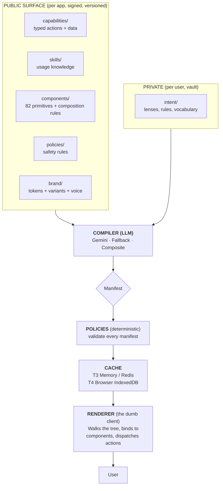
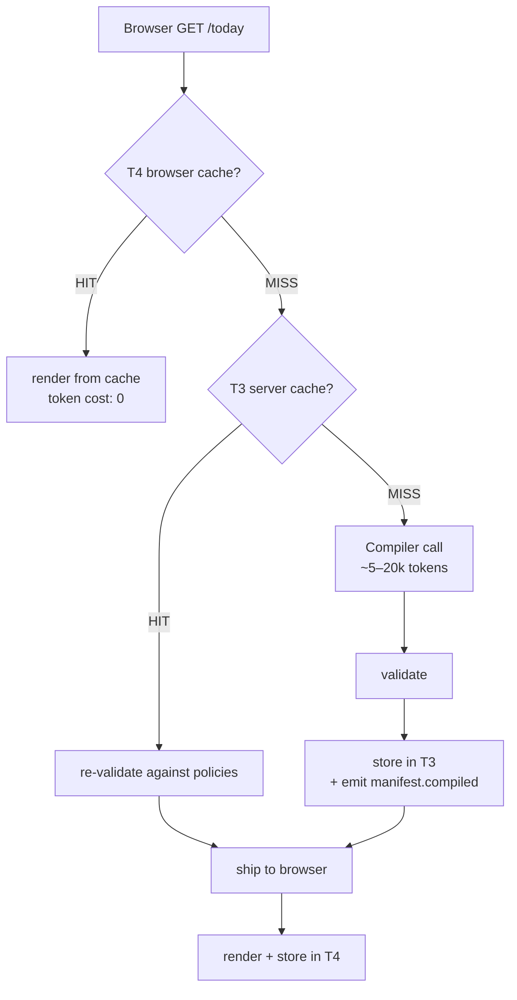

Five public artifacts at the top, signed and versioned by the app. One private artifact below them belongs to the user. The compiler is the only LLM-touching component. Every manifest passes the policy engine before serving. **Once cached, nothing in the hot path is non-deterministic.**

## The pipeline

## Cold path vs. hot path

**Cost.** One LLM call on the cold path. Zero on the hot path. Triggers — capability bumped, intent changed, component removed, user-requested recompile — are the only things that invalidate. Render is a pure function of `(manifest, data)`.

## Packages at a glance

- **`@atelier/schemas`** — Zod schemas + JSON Schema codegen for every Atelier artifact.
- **`@atelier/policies`** — Pure-function validators + `PolicyRegistry` for app-supplied policies + behavioral pattern detector interface.
- **`@atelier/runtime`** — Framework-agnostic core: cache, fetcher, resolver, dispatcher, trigger bus + SSE, render-plan builder, audit sinks.
- **`@atelier/components`** — 82 baseline React primitives with composition rules and per-component metadata.
- **`@atelier/react`** — React adapter: `<CirRuntime>`, `<CirRoute>`, hooks, confirmation portal, SWR + optimistic UI, debug panel.
- **`@atelier/compiler`** — LLM-backed compile service: Gemini + Fallback + Composite, manifest store implementations, server-side resolver.
- **`@atelier/cli`** — Unified developer CLI: `atelier init / dev / add / components-sync / validate / import / inspect / compile / vault`.
- **`@atelier/vault-server`**, **`@atelier/vault-client`** — Reference intent vault and typed wire client.

---

The full chapter — including caching tiers, trigger taxonomy, cost economics, and the production threat model — lives at [`docs/architecture.md`](https://github.com/fragmatic-io/atelier/blob/main/docs/architecture.md).
