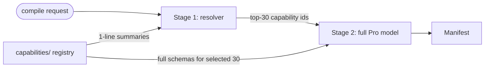

The single-prompt compiler stuffs all capability schemas into the system prompt. That's fine up to ~150 capabilities. Past that, the token budget blows out, the LLM ignores half the registry, and accuracy plummets.

Wave C-3 (a.k.a. S-1) introduces a two-stage compile: a small / fast resolver picks ~30 relevant capabilities from one-line summaries, and the full Pro model receives only those 30 schemas.

## The two-stage flow



**Stage 1** — A fast, cheap resolver receives the route + intent + a flat list of `{ id, summary }` for every capability. Its only job is to pick ~30 capabilities relevant to the route. Cost: a few hundred tokens (LLM resolver) or sub-millisecond (substring / vector resolver).

**Stage 2** — The Pro model receives the full schema for those 30 capabilities + the recipe + intent + skill stack. It composes the manifest as before. Cost: the usual 8-20k tokens.

Total: ≈ 200ms slower on cold path; massively cheaper than dragging 1000 schemas through every compile.

## The package — `@atelier/capability-resolver`

A pure-function package, sibling to `@atelier/compiler`. The headline interfaces:

```ts
export interface CapabilityResolver {
  /** Stable identifier surfaced in audit / logs. */
  readonly id: string;
  /**
   * Lower-level entry-point — the production seam. Returns up to `k`
   * capability refs (id + description) given a free-form intent +
   * route + user/app context.
   */
  scope(
    request: ScopeRequest,
    k: number,
    registry: Readonly<Record<string, Capability>>,
  ): Promise<readonly { id: string; description?: string }[]>;
}

export interface HighLevelCapabilityResolver {
  readonly id: string;
  /** Pick the top-N most relevant capabilities for a given query. */
  resolve(query: HighLevelQuery): Promise<HighLevelResult>;
  /** Index a corpus of capabilities. Idempotent. */
  index(capabilities: readonly Capability[]): Promise<void>;
}
```

The package ships three reference implementations:

- `SubstringCapabilityResolver` — fast / free baseline. No LLM call; substring + token-overlap match against capability id + description. The same logic that ships as `@atelier/compiler`'s `fallbackFindCapability`, but properly packaged. Used as the cascade target for the other resolvers.
- `EmbeddingCapabilityResolver` — embedding-based ranker. Plugs in any `EmbeddingClient` (OpenAI / Cohere / Gemini / a local model) + a pre-built `EmbeddingIndex`. Cosine similarity over dense vectors; cascades to substring on client errors or empty index.
- `TwoStageCapabilityResolver` — production. Stage 1 calls a tiny model (`gemini-2.5-flash` by default) over 1-line capability summaries and returns the top-K ids. Cascades to substring on stage-1 failure (LLM error, malformed reply, abort).

`wrapAsHighLevel(scopeResolver, registry)` bridges the lower-level `scope()` shape into the simpler `resolve()`/`index()` contract, for ad-hoc tooling that doesn't want to thread route + user context through every call.

## Wiring into the compiler

`CompileInput` carries an optional `capabilityResolver` field. When set, the compiler runs the resolver BEFORE prompt assembly and substitutes the narrowed registry into the system prompt:

```ts
import { GeminiCompiler, type CompileInput } from '@atelier/compiler';
import { SubstringCapabilityResolver } from '@atelier/capability-resolver';

const compiler = new GeminiCompiler({ apiKey });
const resolver = new SubstringCapabilityResolver();

await compiler.compile({
  user_id: 'demo-user',
  app_id: 'demo',
  route: '/today',
  capabilities: FULL_CAPABILITY_REGISTRY, // 200+ entries
  components: COMPONENT_BINDINGS,
  capabilityResolver: resolver,
  topN: 30, // default, optional
} satisfies CompileInput);
```

Both compiler implementations honour the resolver:

- **`GeminiCompiler`** (single-shot path) — narrows `capabilities` before `buildPromptContext` so only the top-N schemas reach the prompt.
- **`ToolUsingCompiler`** (C-2 agent path) — runs the resolver once before the agent loop. The agent's `findCapability(intent)` tool routes through the narrowed subset; `lookupCapability(id)` and `listCapabilities(filter)` still see the FULL registry, so the agent can broaden by id when scoping was too tight.

The resolver is permissive by design: if it throws, returns nothing, or produces only invented ids, the compile falls through to the full registry rather than starving the prompt.

## Wiring into a production resolver

The `TwoStageCapabilityResolver` is the production-grade option:

```ts
import { GoogleGenAI } from '@google/genai';
import { TwoStageCapabilityResolver, type ScopingLlmClient } from '@atelier/capability-resolver';

const ai = new GoogleGenAI({ apiKey: process.env.GEMINI_API_KEY! });
const stageOne: ScopingLlmClient = {
  id: 'gemini-2.5-flash-scoping',
  async pick({ k, summaries, route, intent, signal }) {
    const r = await ai.models.generateContent({
      model: 'gemini-2.5-flash',
      contents: [
        {
          role: 'user',
          parts: [
            {
              text: [
                'You are a capability scoping pre-pass for a UI compiler.',
                `Given the user intent and route, pick at most ${k} capability ids.`,
                'Return ONLY a JSON array of capability id strings.',
                `route: ${route}`,
                `intent: ${intent}`,
                `capabilities:\n${summaries.map((s) => `- ${s.id}: ${s.summary}`).join('\n')}`,
              ].join('\n\n'),
            },
          ],
        },
      ],
      config: { responseMimeType: 'application/json' },
      ...(signal !== undefined ? { abortSignal: signal } : {}),
    });
    return {
      ids: JSON.parse(r.text ?? '[]') as string[],
      tokenCost: r.usageMetadata?.totalTokenCount ?? 0,
    };
  },
};

const resolver = new TwoStageCapabilityResolver({
  client: stageOne,
  // Optional — log every scope call.
  onScope: (e) =>
    console.log(`scoping: ${e.route} ${e.pickedCount}/${e.registrySize} ${e.durationMs}ms`),
  // Optional — get notified when stage-1 falls back to substring.
  onStageOneFailure: (e) => console.warn(`scoping stage-1 failed for ${e.route}; cascading.`),
});
```

For an offline / no-API-key option, use `EmbeddingCapabilityResolver` with a local sentence-transformer model. The package's `EmbeddingClient` seam is provider-agnostic — any function that returns dense vectors works.

## How `findCapability` plugs in

The C-2 `ToolUsingCompiler` already shipped a `findCapability` tool with a substring fallback. C-3 swaps the resolver underneath that tool: when a `capabilityResolver` is wired, `findCapability` returns matches drawn from the resolver's pre-scoped subset instead of the full registry. The substring fallback inside `SubstringCapabilityResolver` becomes the inner default — the same behaviour as before, now properly packaged + tunable + tested.

## Demo wiring

`apps/demo` ships a default-off integration gated on `CIR_CAPABILITY_RESOLVER_ENABLED=1`. When the flag is set the demo wires `SubstringCapabilityResolver` (no API key required) and threads it onto every compile:

```bash
CIR_CAPABILITY_RESOLVER_ENABLED=1 pnpm --filter @atelier/demo dev
```

Production hosts swap in `EmbeddingCapabilityResolver` or `TwoStageCapabilityResolver` for higher-quality scoping.

## When to enable

Trigger: **first host with >150 capabilities.** Below that, the full registry fits in the prompt and the resolver overhead loses. Above 150, the tipping point is sharp:

| Registry size | Single-prompt cost  | Two-stage cost                    |
| ------------- | ------------------- | --------------------------------- |
| 50            | 8k tokens           | 8.5k tokens (overhead loses)      |
| 150           | 22k tokens          | 12k tokens (break-even)           |
| 500           | 60k tokens (fails)  | 14k tokens                        |
| 1000          | 110k tokens (fails) | 14k tokens (with vector resolver) |

`TwoStageCapabilityResolver` works up to ~1000 capabilities; past that, `EmbeddingCapabilityResolver` (S-7) is the upgrade.

## Tests

The package ships ~90 tests covering substring + two-stage + embedding behaviour, the cascade story, and the `wrapAsHighLevel` adapter. The compiler ships ~15 tests covering the resolver-on / resolver-off paths and the rejection cascade. Embedding tests that need a heavy model download are gated behind `CIR_EMBEDDING_TESTS=1`.

## Next

- [Compiler → Tools](/compiler/tools/) — the `findCapability` tool C-3 plugs into.
- [Compiler → Budget enforcement](/compiler/budget/) — once you're paying per-stage, budgets matter more.
- [Operations → Performance](/operations/performance/) — when scoping latency becomes load-bearing.
