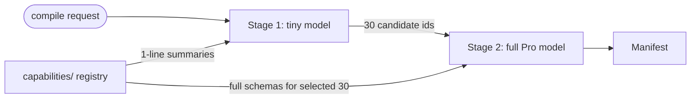

The single-prompt compiler stuffs all capability schemas into the system prompt. That's fine up to ~150 capabilities. Past that, the token budget blows out, the LLM ignores half the registry, and accuracy plummets.

Wave C-3 (a.k.a. S-1) introduces a two-stage compile.

## The two-stage flow



**Stage 1** — A fast, cheap model receives the recipe + intent + a flat list of `{ id, summary }` for every capability. Its only job is to pick ~30 capabilities relevant to the route. Cost: a few hundred tokens, ~200ms.

**Stage 2** — The Pro model receives the full schema for those 30 capabilities + the recipe + intent + skill stack. It composes the manifest as before. Cost: the usual 8-20k tokens.

Total: ≈ 200ms slower on cold path; massively cheaper than dragging 1000 schemas through every compile.

## The new package

`@atelier/capability-resolver` will ship as a sibling to `@atelier/compiler` (gated on track S-1; trigger: first host with >150 capabilities). The interface:

```ts
export interface CapabilityResolver {
  scope(input: ScopeInput): Promise<{ capability_ids: string[]; tokens_used: number }>;
}

export interface ScopeInput {
  recipe: Recipe;
  intent: IntentProfile;
  route: string;
  registry: Array<{ id: string; summary: string }>;
  max_results?: number; // default 30
}
```

Two reference implementations:

- `LLMCapabilityResolver` — calls a fast model (Gemini Flash, etc.) with the registry.
- `VectorCapabilityResolver` — calls a vector store indexed on capability descriptions; no LLM in the scoping step. (Track S-7; higher quality, more setup.)

## Code

```ts
import { ToolUsingCompiler, LLMCapabilityResolver } from '@atelier/compiler';

const resolver = new LLMCapabilityResolver({
  apiKey: process.env.GEMINI_API_KEY!,
  model: 'gemini-1.5-flash',
});

const compiler = new ToolUsingCompiler({
  apiKey: process.env.GEMINI_API_KEY!,
  toolEnv: makeToolEnvironment({
    capabilities: yourFullCapabilityRegistry,
    components: COMPONENT_BINDINGS_METADATA,
    policies: BASELINE_POLICIES,
    capabilityResolver: resolver, // ← C-3 plug-in
  }),
});
```

When the agent calls `findCapability(query)`, the tool routes through the resolver. If the host registers a `LLMCapabilityResolver`, that's the stage-1 tiny-model path. If they don't, the tool falls back to substring search across the registry (the default behaviour).

## Why this composes with C-2

The tool-using compiler's `findCapability` tool is the natural surface for capability scoping. Instead of stuffing the full registry into the prompt, the agent calls `findCapability(query)` and the host wires it to whatever scoping strategy makes sense.

This means **C-2 is the architectural prerequisite for C-3**. With the agent already calling tools to discover capabilities, C-3 is a pluggable backend swap, not a new architecture.

## When to enable

Trigger: **first host with >150 capabilities.** Below that, the substring fallback is fine. The LLM's context window is large enough to hold all 150 schemas, and the cost of a single full-registry compile is bounded.

Above 150, the tipping point is sharp:

| Registry size | Single-prompt cost  | Two-stage cost                    |
| ------------- | ------------------- | --------------------------------- |
| 50            | 8k tokens           | 8.5k tokens (overhead loses)      |
| 150           | 22k tokens          | 12k tokens (break-even)           |
| 500           | 60k tokens (fails)  | 14k tokens                        |
| 1000          | 110k tokens (fails) | 14k tokens (with vector resolver) |

`LLMCapabilityResolver` works up to ~500 capabilities; past that, `VectorCapabilityResolver` (S-7) is the upgrade.

## Trigger

Track S-1 is the integration point. The trigger to enable two-stage compile is: **a host registers a registry larger than the default threshold, and the eval harness measures recall drop on the single-prompt path.**

Until that happens, you don't need this. The framework default ships with the substring fallback, which is good enough for every demo and most real apps.

## Status

This page describes a roadmap track. The wrapper interfaces ship; the reference implementations are deferred until a real host hits the scaling cliff. See [TODO.md → Wave C](https://github.com/fragmatic-io/atelier/blob/main/TODO.md) for the current state.

## Next

- [Compiler → Tools](/compiler/tools/) — the `findCapability` tool C-3 plugs into.
- [Compiler → Budget enforcement](/compiler/budget/) — once you're paying per-stage, budgets matter more.
- [Operations → Performance](/operations/performance/) — when scoping latency becomes load-bearing.
