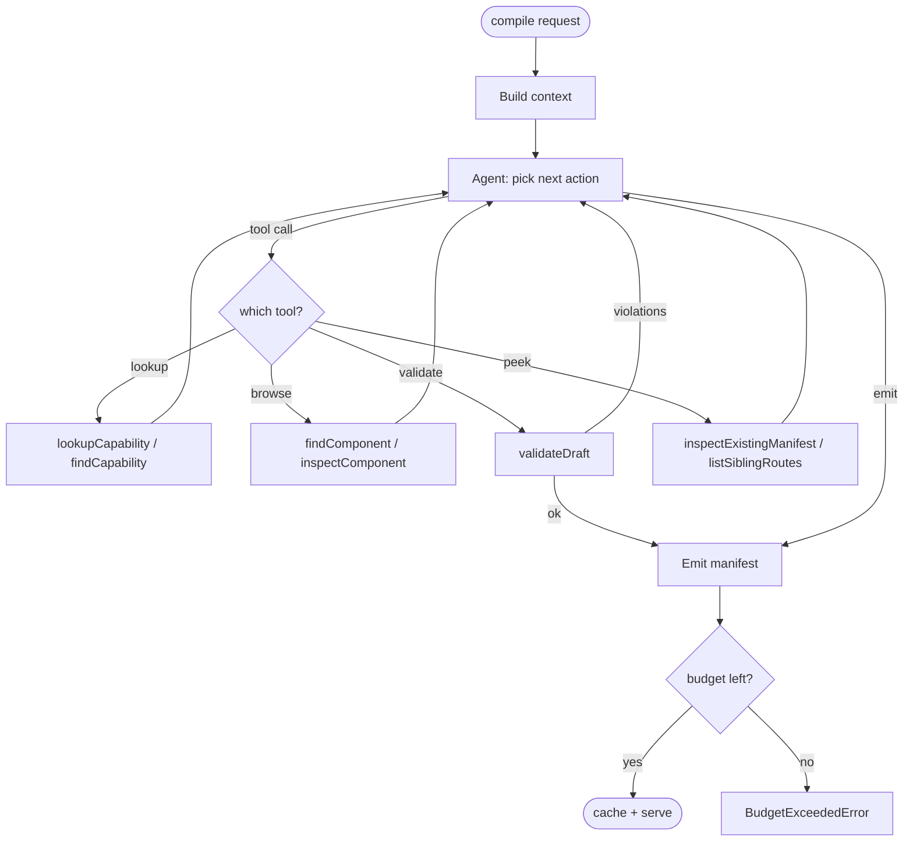

The Atelier compiler today is a **single tool-using agent**, not a flat multi-agent orchestration. Tools + reflection capture roughly 80% of the multi-agent benefit at 20% of the cost. Latency stays bounded; per-compile token cost drops; accuracy improves.

## The agent loop



The agent gets a system prompt, the recipe, the user's intent slice, and access to nine tools. It calls tools to discover what it needs, drafts a manifest, calls `validateDraft` against the policy engine, patches if violations come back, and emits when validate is ok.

## The packages

```text
@atelier/compiler
├── GeminiCompiler              single-shot LLM call (legacy / fallback)
├── ToolUsingCompiler           the canonical surface — wraps GeminiAgentClient
├── ValidationFeedbackCompiler  C-1: re-prompt with violations
├── BudgetMeteredCompiler       S-6: per-user token budget enforcement
├── CompositeCompiler           cascade through multiple compilers
├── GenericFallbackCompiler     deterministic fallback when LLM is unavailable
└── ServerManifestResolver      host-side wrapper that hits the compile worker
```

The composition you wire is typically:

```ts
import {
  ToolUsingCompiler,
  ValidationFeedbackCompiler,
  BudgetMeteredCompiler,
  CompositeCompiler,
  GenericFallbackCompiler,
} from '@atelier/compiler';

const llmCompiler = new ValidationFeedbackCompiler(
  new ToolUsingCompiler({ apiKey: process.env.GEMINI_API_KEY!, toolEnv }),
  { maxRetries: 2 },
);

const budgeted = new BudgetMeteredCompiler(llmCompiler, {
  budget: { tokens: 50_000, window_ms: 86_400_000 },
  counter,
});

const compiler = new CompositeCompiler([budgeted, new GenericFallbackCompiler()]);
```

That stack:

1. Tries the LLM compiler with up to 2 validation-feedback retries.
2. Tracks tokens against the user's daily budget; throws `BudgetExceededError` if breached.
3. Cascades through to the deterministic fallback if anything throws `CompilerOutputError`.

## What "single tool-using agent" means in code

Roughly:

```ts
async function compile(input: CompileInput): Promise<CompileOutput> {
  const transcript: Message[] = [systemPrompt(), userPrompt(input)];
  let attempts = 0;

  while (attempts++ < MAX_AGENT_STEPS) {
    const response = await gemini.generateContent({
      model: 'gemini-1.5-pro',
      contents: transcript,
      tools: TOOL_DECLARATIONS,
    });

    if (response.functionCalls?.length) {
      // model wants to call tools
      for (const call of response.functionCalls) {
        const result = await executeTool(call, input.toolEnv);
        transcript.push({ role: 'tool', name: call.name, content: result });
      }
      continue;
    }

    // model emitted a final manifest
    const draft = parseManifest(response.text);
    return { manifest: draft, tokens_used: response.usage.total };
  }

  throw new CompilerOutputError('agent did not converge within step limit');
}
```

Bounded loop. Tool calls are structured (function-calling, not free-form). The agent never invents a capability or a component — it can only call `lookupCapability(id)` against the registry the host supplied.

## Why not multi-agent?

We deliberately do NOT do:

- ❌ Flat Plan→Compose→Validate→Refine multi-agent pipeline as the default. High latency (60-90s vs today's ~22s), high cost, marginal accuracy gain over C-1.
- ❌ Per-component specialist agents ("a `<Queue>` agent, a `<Card>` agent"). Component selection is a single decision.
- ❌ Free-form conversation between agents. Atelier compilation is structured output, not research.

A future C-4 ("outline agent for multi-route apps") may add a one-time outline pass that produces brand chrome shape, nav structure, common policies once — and per-route compiles inherit. That's bounded multi-agent (work parallelises) and helps cross-route coherence in V-6 marketplace apps.

## Code: a minimal compile

```ts
import { ToolUsingCompiler, makeToolEnvironment } from '@atelier/compiler';
import { BASELINE_POLICIES } from '@atelier/policies';

const compiler = new ToolUsingCompiler({
  apiKey: process.env.GEMINI_API_KEY!,
  toolEnv: makeToolEnvironment({
    capabilities: loadCapabilities('./capabilities'),
    components: loadComponents('./components/registry.json'),
    policies: BASELINE_POLICIES,
  }),
});

const result = await compiler.compile({
  recipe: founderRecipe,
  intent: userIntentProfile,
  route: '/today',
});

console.log(result.manifest); // the manifest tree
console.log(result.tokens_used); // for budget accounting
console.log(result.tool_call_count); // observability
```

## What ships today

- ✅ **C-1** — Validation feedback loop. Wraps any compiler. (`497e99d`)
- ✅ **C-2** — Tool-using compiler. Nine tools, **default-on** as of TODO P1.1 (2026-05-04); opt out via `ATELIER_COMPILER_TOOLS=off`. Legacy `CIR_COMPILER_TOOLS_ENABLED=0` honoured for one release cycle.
- ⏳ **C-3 / S-1** — Capability scoping. Two-stage compile: tiny model picks 30 from 1-line summaries; full Pro model gets those 30 schemas. Trigger: first host with >150 capabilities.
- ⏳ **C-4** — Outline agent for multi-route apps.
- ⏳ **C-5** — Marketplace retrieval (RAG; gated on V-6).

## Observability

Every compile fires through the audit sink:

```text
compile.started     route=/today compiler=ToolUsingCompiler
compile.tool_call   name=lookupCapability args={id:'thread.list'}
compile.tool_call   name=findComponent args={hint:'queue with grouping'}
compile.tool_call   name=validateDraft args={...}
compile.completed   tokens=11423 duration_ms=2841
```

The demo's `<CompileBadge>` surfaces this in the chrome — token count, duration, retry count. Principle #5: visible compilation.

## Next

- [Compiler → Tools](/compiler/tools/) — the nine tools the agent calls.
- [Compiler → Validation feedback](/compiler/validation-feedback/) — Wave C-1 in detail.
- [Compiler → Capability scoping](/compiler/capability-scoping/) — Wave C-3 / S-1.
- [Compiler → Budget enforcement](/compiler/budget/) — `BudgetMeteredCompiler`.
