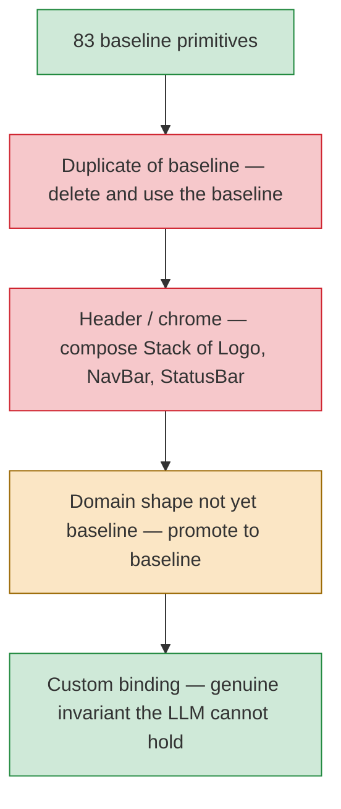

The framework's promise is: **give the compiler mature primitives, strict
composition rules, brand tokens, and operational composites, and it will compose
useful policy-safe workbenches.** That promise is only real if hosts can ship
operational apps **without** writing per-host React for every domain shape.

Each per-host `ComponentBinding` registered on top of `@atelier/components`'s
`COMPONENT_BINDINGS` is a local escape hatch — a place where the host has
decided the compiler cannot be trusted to compose the shape from baseline
vocabulary.

## The pressure pyramid



Reading the pyramid: most "custom bindings" sit at the wide bottom (duplicates, chrome). Almost none are genuinely justified at the tip.

## Most "custom bindings" are smell

### Duplicates of baseline

A `RepoTable` that wraps `<Table>` with the same columns. A `RateLimitStatusBar` that wraps `<StatusBar>`. A `ThreadView` that wraps `<ChatThread>`.

**Action: delete and use the baseline.**

### Header / chrome

`OctantHeader` / `MarigoldHeader` / `Wordmark` are usually just `<Stack(Logo, NavBar, StatusBar)>`.

**Action: compose, don't author.**

### Domain shapes the marketplace doesn't yet cover

Inbox / task / issue queues, product cards, conversation lists.

**Action: promote the shape to baseline, not entrench another per-host binding.** `Queue` and `Logo` were promoted in the marketplace pivot exactly to collapse the inbox / task / wordmark patterns.

## The defensible reasons for a custom binding

Two only:

1. **A genuine invariant the LLM cannot reliably hold.** Example: "every issue row MUST carry a hover-card author preview wired to the presence service." Even then, examine whether a `compositionRole` + a slot contract would express the same constraint without inventing a component.

2. **A capability that has no baseline analogue at all.** Rare; usually means a missing primitive that should be promoted.

Anything else is the host saying "I don't trust the LLM to compose this from primitives" — which is a vote against the framework's central thesis.

## The marketplace pressure gate

`tests/marketplace-pressure.test.ts` caps each demo's custom binding count and ratchets it down. Every entry is documented as a known follow-up. **Adding a new binding without first attempting (a) a baseline promotion or (b) a composition fails the gate.** Lowering the ceiling by deleting a binding is the only way to grow the marketplace.

```ts
// tests/marketplace-pressure.test.ts (excerpt)
const CEILINGS = {
  'apps/demo': 0, // Aurora — zero customs
  'apps/demo-github': 0, // Octant — zero customs
  'apps/demo-dummyjson': 0, // Marigold — zero customs
};

test.each(Object.entries(CEILINGS))('%s ships at most %i custom bindings', (path, ceiling) => {
  const customs = countCustomBindings(path);
  expect(customs).toBeLessThanOrEqual(ceiling);
});
```

## A demo's custom-binding count

…is a useful smell test for whether the framework's baseline-first promise is
being kept. It is not the whole product test. The stronger test is whether a
generated operational workflow can move from context → decision →
policy-confirmed dispatch → audit without handwritten route UI. The three
reference demos all ship **zero** as of Wave M (2026-05-02).

| Demo                             | Pre-pivot | Post-pivot |
| -------------------------------- | --------- | ---------- |
| `apps/demo` (Aurora)             | 4 customs | **0**      |
| `apps/demo-github` (Octant)      | 5 customs | **0**      |
| `apps/demo-dummyjson` (Marigold) | 8 customs | **0**      |

The 17 customs that disappeared:

- Aurora: `DecisionQueue`, `TaskQueue`, `ThreadView`, `UndoBar` — all retired in favour of `<Queue>` + ambient `<UndoToast>` (`UNDO_TOAST_AMBIENT_SATISFIER`).
- Octant: `Wordmark`, `OctantHeader`, `RepoTable`, `RateLimitStatusBar`, `IssueQueue` — retired in favour of `<Stack(Logo, NavBar, StatusBar)>` + `<Queue>`.
- Marigold: `MarigoldHeader`, `Wordmark`, `RateLimitChip` (chrome), `ProductCard`, `ProductGrid`, `ProductDetail`, `CartItemList`, `CheckoutWizard` — retired in favour of `<Stack(Logo, NavBar, StatusBar)>` + data-aware `<Grid>` + tile-shaped `<Card>` + `<Queue>`.

## Trade-offs accepted

The pivot wasn't free. Plainer per-row rendering on `<Queue>` (no hover-card mention previews on rows; manifests can't pass `renderItem` functions). Multi-select dropped from Octant inbox. Qty selector dropped from Marigold cart rows. 5-star rating + strike-through original price dropped from Marigold product detail. Sidebar wizard + progressive disclosure dropped from Marigold checkout.

These are documented. Promoting more shapes to baseline (per-row inline-form slot, inline rating slot, manifest-driveable `<Wizard>` body) closes them.

## How to "promote to baseline"

1. **Identify the shape.** What pattern keeps showing up across multiple demos?
2. **Spec the contract.** What props does it take? What composition role does it play? What action slots? What slots for state (empty / loading / error)?
3. **Add it to `@atelier/components`.** Implement the binding, the metadata, the composition rule.
4. **Update the catalog summary.** The compiler reads this to know when to pick the new component.
5. **Migrate the demos.** Delete the custom bindings the new baseline replaces.
6. **Lower the marketplace pressure ceiling.** The gate tests now allow fewer customs.

The marketplace pivot did this for `<Queue>` and `<Logo>`. The pattern repeats every time a new domain shape stabilises.

## Custom bindings — the API surface

If you've genuinely justified a custom binding, here's the wiring:

```ts
import { COMPONENT_BINDINGS, type ComponentBinding } from '@atelier/components';

const MyCustomBinding: ComponentBinding = {
  name: 'MyCustomThing',
  Component: MyCustomReactComponent,
  contract: {
    props: z.object({
      /* ... */
    }),
    actions: ['onPrimaryAction'],
    compositionRole: 'leaf',
  },
  catalogSummary: 'A custom shape for foo. Use when bar.',
};

const services = configureCirRuntime({
  componentBindings: { ...COMPONENT_BINDINGS, MyCustomThing: MyCustomBinding },
});
```

Document _why_ in the recipe's commit body. Future you will want to know.

## Next

- [Components → Composition rules](/components/composition-rules/) — `can_contain` in detail.
- [Components → Catalog](/components/catalog/) — the 83 baselines.
- [Concepts → Manifest](/concepts/manifest/) — `ManifestComponentContract` validates props.
