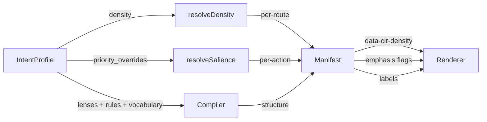

The **intent profile** is the private artifact. It belongs to the user, lives in the vault, and is what the compiler reads (with the user's scoped grant) to personalise the manifest.

## Anatomy

```json
{
  "user_id": "vid",
  "profile_version": 47,
  "updated_at": "2026-04-29T12:00:00Z",
  "global_preferences": {
    "density": "compact",
    "color_mode": "system",
    "modal_tolerance": "low",
    "automation_trust": "drafts_only",
    "primary_workflow": "task_queue",
    "decision_separation": true
  },
  "lenses": {
    "email": "founder_inbox",
    "calendar": "deep_work_blocks",
    "github": "review_queue"
  },
  "rules": [
    {
      "scope": "email",
      "rule": "Investor and customer emails surface above newsletters",
      "version": 12
    },
    {
      "scope": "*",
      "rule": "Never auto-send. Drafts only.",
      "version": 1,
      "locked": true
    }
  ],
  "vocabulary": {
    "the team": ["alice", "bob", "charlie"],
    "investors": ["@gp1.vc", "@gp2.vc"]
  },
  "priority_overrides": {
    "issue.close": "high",
    "newsletter.read": "low"
  },
  "density_overrides": [
    { "route_glob": "/inbox", "density": "compact" },
    { "route_glob": "/threads/*", "density": "cozy" }
  ]
}
```

## How intent shapes the manifest

The compiler reads three signals from the profile and reshapes accordingly:



### Density (Vis-6)

`global_preferences.density` is the global default. `density_overrides` is a list of `{ route_glob, density }` entries that override per-route. `resolveDensity(intent, route)` is the canonical resolver in `@atelier/runtime`.

The renderer emits `data-cir-density` on the route's outermost wrapper and threads the resolved density into every density-aware component (`Stack`, `Container`, `Card`, `Grid`, `List`, `Table`, `Queue`, `KPIRow`, `StatCard`, `DetailView`, `Skeleton`, `VirtualList`, `VirtualTable`).

### Salience (P-9)

Capabilities declare `salience_level: "low" | "medium" | "high"`. The user's `priority_overrides` map can lift or sink any capability. `resolveSalience(capability, intent)` is the resolver. The data-resolver auto-emphasises high-salience items (`withHighSalienceEmphasis`); the compiler-prompt nudges encourage matching layout choices.

### Lenses, rules, vocabulary

These three flow into the compiler prompt directly. The compiler picks layouts that satisfy the lens (`founder_inbox` → "decisions first, batch low-priority"), respects rule-locked behaviour (`Never auto-send`), and substitutes vocabulary (`the team` → the three names listed) when generating labels.

## Code: reading intent

```ts
import { resolveDensity, resolveSalience } from '@atelier/runtime';
import type { IntentProfile, Capability } from '@atelier/schemas';

function howShouldThisRender(intent: IntentProfile, route: string, cap: Capability) {
  const density = resolveDensity(intent, route);
  const salience = resolveSalience(cap, intent);
  return { density, salience };
}
```

## Where the intent profile lives

The profile lives in a **vault** — a user-owned store. The reference vault is `@atelier/vault-server`; the wire format is documented in [`docs/vault-protocol.md`](https://github.com/fragmatic-io/atelier/blob/main/docs/vault-protocol.md).

Apps request scoped read access to slices of the profile via a permission flow (the OAuth-style consent UI ships with the vault server). The user grants `lens.email` access; the app never sees `lens.calendar` or `lens.github`. Apps cannot write directly — only the user (via their agent) can patch.

## Onboarding from free text

Atelier ships `compileIntentProfile()` for LLM-assisted onboarding:

```ts
import { compileIntentProfile } from '@atelier/compiler';

const draft = await compileIntentProfile({
  description:
    "I'm a founder. Investor emails surface above newsletters. I prefer compact density.",
  schema: 'IntentProfileSchema',
});
// → returns a draft IntentProfile the user can review + edit before saving.
```

The demo's `/onboarding/describe` route uses this. The free-text description is request-scoped — never logged, never persisted. Only the structured `IntentProfile` it compiled into ends up in the vault.

## What the user owns

- The profile itself (lenses, rules, vocabulary, density, dark-mode, salience overrides).
- The grants they've issued. Each grant is a `jti`-keyed JWT; revoking it cascades a `system.security_revocation` trigger to every running runtime that subscribes.
- Cross-app workflows (declared in the profile, traversed by a future cross-app compiler).

## What the host doesn't see

- Anything outside the granted scope. If you ask for `lens.email`, the response filters out `lens.calendar` and `lens.github` automatically.
- The free-text intent description that compiled into the structured profile.
- The user's vault password / auth method. The vault and the host are deliberately separate trust domains.

## Next

- [Concepts → Capability](/concepts/capability/) — what the compiler binds intent against.
- [Marketplace → Trust on first use](/marketplace/tofu/) — how the vault establishes trust with a third-party recipe author.
- [Marketplace → Addressing](/marketplace/addressing/) — `atelier://` URI scheme.
