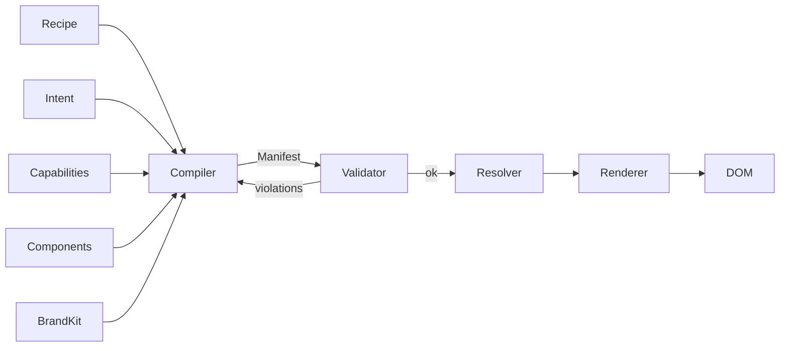

A **manifest** is the LLM compiler's output. It's a declarative interface program — a tree of component nodes with bound capabilities, props, and policies-satisfied claims. The runtime walks it. Once cached, every subsequent render is a pure function of `(manifest, data)`.

## The compile pipeline



Recipe + intent + capabilities + components + brand kit go in. The compiler emits a manifest. The validator runs it through `BASELINE_POLICIES + COMPOSITION_RULES + custom_policies`. If something fails, the validator hands the violations back to the compiler (Wave C-1, the validation-feedback loop) which patches and retries up to N times. Once it passes, the resolver caches it and hands it to the renderer.

## Anatomy

```json
{
  "manifest_id": "m_8f3a2b1c",
  "user_id": "vid",
  "app_id": "mail.example.com",
  "compiled_from": {
    "capability_version": "2.1.0",
    "skill_versions": {
      "email-triage": "1.4.0",
      "smart-reply": "0.9.2"
    },
    "component_catalog_version": "3.0.0",
    "intent_profile_version": 47,
    "compiler_model": "gemini-1.5-pro",
    "compiled_at": "2026-04-29T12:00:00Z"
  },
  "ttl": null,
  "invalidates_on": [
    "capability_schema_change:mail.example.com:>=2.2.0",
    "intent_profile_change:vid:lens.email",
    "explicit_user_request:m_8f3a2b1c"
  ],
  "routes": [
    {
      "path": "/today",
      "title": "Today",
      "layout": {
        "component": "Stack",
        "children": [
          {
            "component": "Queue",
            "props": { "title": "Decisions", "density": "compact" },
            "data": {
              "source": "thread.list",
              "filter": "requires_decision = true AND received_after = today_start",
              "sort": "urgency desc"
            },
            "actions": ["task.create_from_thread", "thread.archive", "draft.create"]
          },
          {
            "component": "Queue",
            "props": { "title": "Tasks", "density": "compact", "group_by": "due_date" },
            "data": { "source": "task.list", "filter": "due_within = 7d AND status != done" },
            "actions": ["task.complete", "task.snooze"]
          }
        ]
      },
      "refresh": {
        "data": "on_focus + 60s_interval",
        "structure": "never_unless_invalidated"
      }
    }
  ],
  "policies_satisfied": [
    "no_destructive_actions_without_confirm",
    "no_send_without_review",
    "data_scope_within_grant",
    "reversibility_surfaced"
  ],
  "rollback_to": "m_8f3a2b1b"
}
```

Plain JSON. No code. The compiler emits it once; the runtime knows how to interpret it forever.

## Walking the tree

The renderer is a depth-first walker:

```ts
import { renderManifest } from '@atelier/react';
import { COMPONENT_BINDINGS } from '@atelier/components';

function renderRoute(manifest: Manifest, route: string) {
  const node = manifest.routes.find((r) => r.path === route)?.layout;
  if (!node) return <NotFound />;

  return walk(node);

  function walk(n: ManifestNode): JSX.Element {
    const Binding = COMPONENT_BINDINGS[n.component];
    if (!Binding) throw new Error(`Unknown component: ${n.component}`);
    const props = mapNodeProps(n);
    const children = (n.children ?? []).map(walk);
    return <Binding {...props}>{children}</Binding>;
  }
}
```

`@atelier/react`'s `<CirRoute path="/today" />` does this for you. You point it at a route and it walks the tree against the registered component catalog.

## Cache lifecycle

Once a manifest is compiled, it's stored at three tiers:

- **T3 — `ManifestStore`.** Server-side, indexed by the cache key. `MemoryManifestStore` for dev; `RedisManifestStore` for production.
- **T4 — Browser persistent.** IndexedDB (`@atelier/runtime`'s `IndexedDBManifestCache`). Survives reloads; LRU-evicts at 200 entries.
- **T5 — Browser memory.** The hydrated component tree itself; lasts the session.

Cascade reads upward (T5 → T4 → T3 → compile). Cascade invalidations downward via the `TriggerBus`.

See [Operations → Performance](/operations/performance/#caching-tiers).

## What invalidates a manifest

| Trigger                      | Invalidates                                                    |
| ---------------------------- | -------------------------------------------------------------- |
| Capability schema changed    | All manifests using `cap_<old_version>` for that app           |
| Capability removed           | All manifests referencing the capability — fail loudly         |
| Component added              | Nothing (additive; manifests opt in on next compile)           |
| Component deprecated         | Manifests using that component, after deprecation grace        |
| Skill content changed        | Manifests compiled with affected skill (semantic invalidation) |
| Policy added/strengthened    | All manifests for that app — re-validate, recompile if invalid |
| Intent profile slice changed | Manifests dependent on that slice                              |
| User explicit recompile      | The specific manifest                                          |

## Schema-validated

`ManifestSchema` in `@atelier/schemas` is the source of truth. The compiler's output is parsed through Zod; malformed manifests are rejected before they ever hit the renderer (principle #7).

`ManifestComponentContract` (the canonical schema landed alongside the marketplace pivot) defines per-component prop schemas. The validator confirms that every node's props match its declared component's contract — no `?? []` defaults at the renderer layer.

### Data binding `filter` shape

`ComponentDataBinding.filter` accepts either form:

- **CEL-like string** — `"status == 'pending'"`, `"due_within = 7d AND status != done"`. Preferred for simple comparisons.
- **Structured object** — `{ field, op, value, and?, or? }` with `op` ∈ `eq | ne | gt | lt | gte | lte | contains | in | nin`. Use when AND/OR clauses make a string awkward, or when the LLM emits this form naturally.

Both forms validate. Resolvers that only speak strings (REST query params, GraphQL variables) coerce structured filters via `formatFilterAsString` from `@atelier/runtime`. In-memory consumers (the mock resolver, ambient previews) can apply either form directly via `applyFilter`.

```json
// CEL-like — preferred for simple cases.
{ "data": { "source": "task.list", "filter": "due_within = 7d AND status != done" } }

// Structured — equivalent semantics, friendlier when nesting and/or branches.
{
  "data": {
    "source": "task.list",
    "filter": {
      "field": "due_within",
      "op": "lte",
      "value": "7d",
      "and": [{ "field": "status", "op": "ne", "value": "done" }]
    }
  }
}
```

## Diff mode

For most recompiles, the compiler doesn't regenerate from scratch. It runs in **diff mode** — given the prior manifest and the trigger, produce only the changes. This saves 70-90% of tokens; see [Token economics](/operations/cost-control/#token-economics).

## Inspecting a manifest

```bash
pnpm atelier inspect manifests/m_8f3a2b1c.json
```

Pretty-prints the tree, expands routes, validates against the current schema, and surfaces any contract violations.

## Next

- [Concepts → Recipe](/concepts/recipe/) — what authors a manifest.
- [Concepts → Policy](/concepts/policy/) — what validates a manifest before serve.
- [Concepts → Trigger](/concepts/trigger/) — what invalidates a cached manifest.
- [Compiler → Overview](/compiler/overview/) — the agent loop that produces it.
