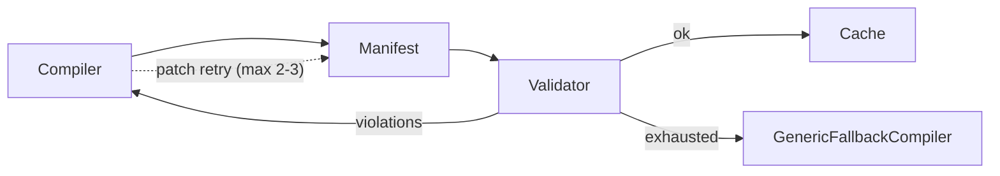

Every manifest passes through the policy engine before it's served. Policies are pure functions — fast, deterministic, no LLM calls. They're the safety net.

## Anatomy

A policy is a function with a stable id, a description, and a `check` that returns `{ ok: true }` or `{ ok: false, violations: [...] }`:

```ts
import type { Policy, PolicyContext } from '@atelier/policies';

export const reversibility_surfaced: Policy = {
  id: 'reversibility_surfaced',
  description: 'Every reversible action must surface an undo affordance.',
  check(ctx: PolicyContext) {
    const violations: string[] = [];
    for (const action of ctx.manifest.actions) {
      const cap = ctx.capabilities.find((c) => c.id === action.capability_id);
      if (cap?.reversible && !ctx.satisfiers.has('UNDO_TOAST_AMBIENT_SATISFIER')) {
        violations.push(`${action.capability_id} is reversible but no undo surface declared.`);
      }
    }
    return violations.length === 0 ? { ok: true } : { ok: false, violations };
  },
};
```

## Baseline policies

`@atelier/policies` ships a baseline set the framework expects every manifest to satisfy:

| Policy id                                | What it enforces                                                                                        |
| ---------------------------------------- | ------------------------------------------------------------------------------------------------------- |
| `data_access_within_grant`               | Every data binding's fields are within the user's granted scope.                                        |
| `no_destructive_actions_without_confirm` | Capabilities with `confirmation: 'modal'` or `'verbal_required'` render through `<ConfirmDialog>`.      |
| `reversibility_surfaced`                 | Reversible actions surface an undo affordance (manifest `<Toast variant="undo">` or ambient satisfier). |
| `rate_limited_actions_show_state`        | Rate-limited capabilities expose remaining quota.                                                       |
| `composes_hierarchy_for_long_lists`      | Bindings with `expected_count > 500` use `<VirtualList>` / `<VirtualTable>`.                            |
| `salience_resolved` (advisory)           | Per-capability `salience_level` flows to `<Queue>` `emphasis` and similar surfaces.                     |
| `consistent_voice` (advisory)            | Generated copy follows the brand kit's `voice` tone.                                                    |

## Custom policies

Apps register custom policies via `PolicyRegistry`:

```ts
import { PolicyRegistry, BASELINE_POLICIES } from '@atelier/policies';

const registry = new PolicyRegistry();
for (const p of BASELINE_POLICIES) registry.register(p);

registry.register({
  id: 'no_external_links_in_modal',
  description: 'Modals must not contain links to external domains.',
  check(ctx) {
    const externalLinkInModal = ctx.manifest.nodes
      .filter((n) => n.component === 'Modal')
      .flatMap((m) => collectLinks(m))
      .filter((href) => isExternal(href));
    return externalLinkInModal.length === 0
      ? { ok: true }
      : { ok: false, violations: externalLinkInModal.map((h) => `external link in modal: ${h}`) };
  },
});
```

Recipes reference policies by id in `policy_obligations`. The validator runs the matching policies after every compile; if anything fails, the validation-feedback compiler (Wave C-1) re-prompts the LLM with the violations and asks it to patch.

## Validation feedback



The compiler gets up to 2-3 retry rounds. Persistent failure cascades to `GenericFallbackCompiler` which ships a hand-written safe manifest. The user never sees a broken UI — they see either a valid compiler-emitted manifest or a hand-written fallback.

## Ambient satisfiers

Some policy obligations are satisfied by **ambient runtime services** rather than manifest nodes. The classic example: `<UndoToast>` doesn't appear in any manifest tree, but the `withUndo()` middleware mounts a `<Toast variant="undo">` on every undoable dispatch. The runtime declares this with an ambient satisfier:

```ts
export const UNDO_TOAST_AMBIENT_SATISFIER = {
  id: 'UNDO_TOAST_AMBIENT_SATISFIER',
  satisfies: ['reversibility_surfaced'],
};
```

The validator sees this as part of `PolicyContext.satisfiers` and skips the corresponding manifest-tree check. This is principle #4 in action: policies enforce, but ambient services that satisfy obligations declare what they satisfy and let the validator see them.

## Why policies, not validation in the renderer?

Three reasons:

1. **Render-time validation is too late.** If a manifest is broken, the user sees a broken UI before the renderer notices. Policies fail fast at compile time.
2. **Defensive renderer code is a smell.** `?? []` defaults and `try/catch` walls are forgiveness for an enforcement gap (principle #7). Catch it once at compile, never at render.
3. **The compiler can fix its own mistakes.** Validation feedback lets the LLM patch; renderer-time errors don't have that loop.

## Performance

Policies run in microseconds — they're pure functions over already-parsed JSON. The full baseline runs in &lt;1ms for typical manifests. Custom policies should be similarly fast; if you find yourself doing IO inside `check()`, you've drifted off-pattern.

## Next

- [Concepts → Manifest](/concepts/manifest/) — what gets validated.
- [Compiler → Validation feedback](/compiler/validation-feedback/) — Wave C-1 in detail.
- [Components → Undo toast](/components/undo-toast/) — the canonical ambient satisfier.
