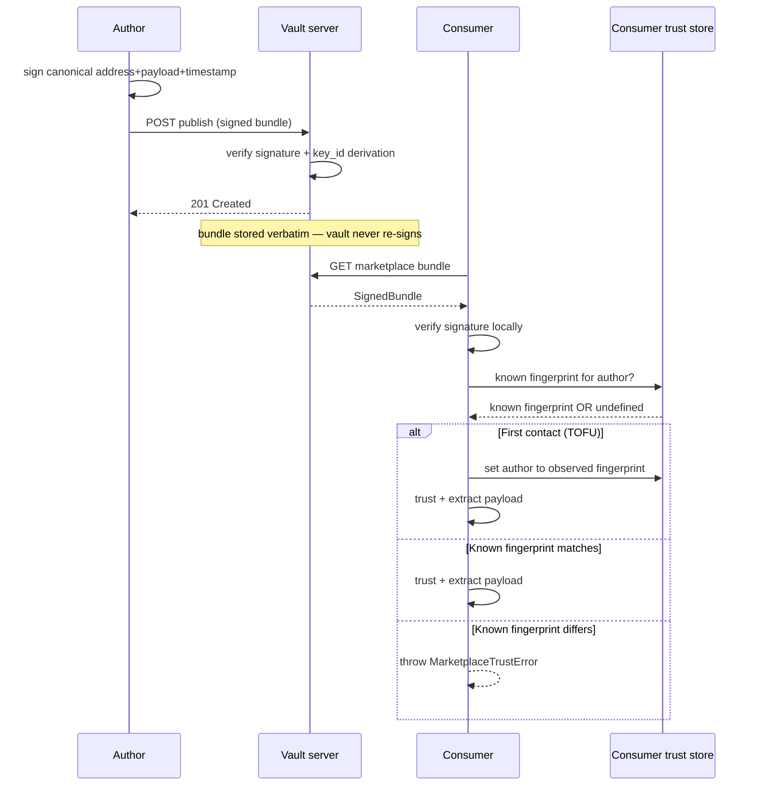

The marketplace is the user-facing distribution surface for recipes, personas, and capability bundles. Authors publish signed payloads against an `atelier://` address; consumers fetch and locally verify before installing. The vault is the trust root: it stores the signed bundle and re-serves it verbatim, never re-signing.

## Status

> **v0** (Wave 8 / track V-6 MVP). The marketplace pivot (Wave M) was the **architectural prerequisite** — the demos prove that an LLM compiler with a rich primitive marketplace really can compose any domain UI. V-6 is what turns it into a product.

What ships today: `atelier://author/persona@version` addressing, ed25519-signed bundles, TOFU (trust on first use) trust model on top of the existing vault. Review-flow UI, search/discovery, and compiler integration (C-Phase-5 RAG) are deferred to follow-ups.

## The publish + consume flow



## Endpoints

`@atelier/vault-server` ships three new endpoints for V-6:

- **`POST /vault/marketplace/publish`** — submit a signed bundle.
- **`GET /vault/marketplace/<author>/<persona>@<version>`** — fetch a signed bundle.
- (Trust on first use happens client-side; the server does not maintain a trust store.)

See [Marketplace → Publishing](/marketplace/publishing/) and [Marketplace → Consuming](/marketplace/consuming/) for the wire details.

## What a bundle contains

```json
{
  "address": {
    "scheme": "atelier",
    "author": "acme",
    "persona": "email-triage",
    "version": "1.0.0"
  },
  "payload": {
    "recipe": {
      /* RecipeSchema-shaped */
    },
    "skills": [{ "name": "email-triage", "version": "1.0.0", "markdown": "..." }],
    "brand_kit": {
      /* optional BrandTokensSchema-shaped */
    }
  },
  "timestamp": "2026-05-02T12:00:00.000Z",
  "signature": "<base64 ed25519 over canonical JSON of {address, payload, timestamp}>",
  "public_key": "<base64 raw 32-byte ed25519 public key>",
  "key_id": "<first 16 hex chars of sha256(public_key)>"
}
```

A recipe + the matching skills + an optional brand kit. The unit of distribution is the `(persona, version)` tuple.

## The trust model

**Trust on first use (TOFU).** The first time a consumer fetches a bundle from `acme`, they record the observed `key_id` fingerprint. Every subsequent fetch from `acme` must match.

If a key change is observed, the client throws `MarketplaceTrustError(known, observed)` and surfaces both fingerprints to the user. The user explicitly accepts via `trustedKeys.set(author, observedKeyId)` to update the cache. Browser-side TOFU UI is a follow-up.

**Pinning.** A consumer can pin to a specific fingerprint via `?signed_by=<key_id>` in the address:

```text
atelier://acme/email-triage@1.0.0?signed_by=8f3a2b1c4d5e6f70
```

When pinned, the TOFU cache is bypassed; the fetch must match the pinned fingerprint exactly. Useful for high-stakes bundles where the consumer wants explicit-key-pinning rather than first-contact-trust.

## Demo toggle

The reference demo (`apps/demo`) gates marketplace boot behind `CIR_MARKETPLACE_ENABLED=1`. Default boot is unchanged. When the flag is set, `getCirServer()` exposes a `marketplace` surface the integration smoke can drive.

## What's deferred

- **Browser-side TOFU UI.** When a key change is observed, today the client throws and the host shows whatever its error UI shows. A canonical "this author's key changed — accept or reject?" surface is roadmap.
- **Search / discovery.** Today consumers fetch by exact address. A `GET /vault/marketplace/search?q=...` endpoint with vector indexing is roadmap.
- **Per-version immutability.** Today republishing the same `<author>/<persona>@<version>` overwrites. We trust the signed timestamp to disambiguate stale fetches; immutability per-version is a follow-up.
- **Compiler integration (C-5 RAG).** A `findRecipe` tool against a vector-indexed marketplace is roadmap.

## Why this matters

The marketplace pivot proved you can ship a real domain UI without writing a single custom binding. The marketplace turns that capability into a distributable product:

- A skill author publishes `atelier://taskmaster/founder-inbox@1.0.0`.
- A founder boots a fresh Atelier app, types `atelier add taskmaster/founder-inbox@1.0.0`.
- The CLI fetches the bundle, verifies, presents the consent surface (capabilities granted, scopes requested), and installs it.
- The user gets a personalised UI authored by someone they trust, without that author having to build a separate app.

The framework's marketplace promise becomes a marketplace.

## Next

- [Marketplace → Addressing](/marketplace/addressing/) — the `atelier://` URI scheme.
- [Marketplace → Signing](/marketplace/signing/) — ed25519 + canonical JSON.
- [Marketplace → Trust on first use](/marketplace/tofu/) — the TOFU model.
- [Marketplace → Publishing](/marketplace/publishing/) — author walkthrough.
- [Marketplace → Consuming](/marketplace/consuming/) — consumer walkthrough.
