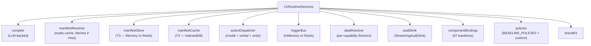
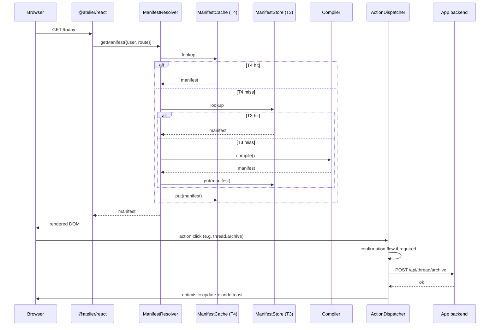

`@atelier/runtime` is the framework-agnostic core. It has no opinions about React, Next.js, Vite, or any specific host. It owns the manifest cache, the action dispatcher, the trigger bus, the resolver, and the audit pipeline.

## The services bag

Every Atelier app wires a `CirRuntimeServices` bag at boot:



Every service has a default in-process implementation. Production deploys swap in distributed alternatives (Redis store, Redis bus, externalised compiler worker).

## Configuring the runtime

```ts
import { configureCirRuntime } from '@atelier/runtime';
import { COMPONENT_BINDINGS } from '@atelier/components';
import { BASELINE_POLICIES, PolicyRegistry } from '@atelier/policies';
import {
  ToolUsingCompiler,
  ValidationFeedbackCompiler,
  CompositeCompiler,
  GenericFallbackCompiler,
  MemoryManifestStore,
  ServerManifestResolver,
} from '@atelier/compiler';

const policyRegistry = new PolicyRegistry();
for (const p of BASELINE_POLICIES) policyRegistry.register(p);

const services = configureCirRuntime({
  compiler: new CompositeCompiler([
    new ValidationFeedbackCompiler(
      new ToolUsingCompiler({ apiKey: process.env.GEMINI_API_KEY!, toolEnv }),
      { maxRetries: 2 },
    ),
    new GenericFallbackCompiler(),
  ]),
  manifestStore: new MemoryManifestStore(),
  componentBindings: COMPONENT_BINDINGS,
  policies: policyRegistry,
  triggerBus: new InMemoryTriggerBus(),
  dataResolver: yourDataResolver,
  brandKit: aurora,
  auditSink: new StreamingAuditSink(),
});
```

## The walk: a request through the runtime



The cache cascade is the heart of the framework's cost model. Cold-path compile happens once per `(user, app, route, version-tuple)`. Every other render is a cache hit.

## What's in the package

```text
@atelier/runtime
├── manifest/
│   ├── ManifestStore       (Memory + interface)
│   ├── ManifestCache       (IndexedDB + Memory)
│   └── ManifestFetcher
├── dispatcher/
│   ├── ActionDispatcher    (the action surface)
│   ├── withUndo            (Int-8 middleware)
│   └── confirmation flows  (modal + verbal-phrase)
├── trigger/
│   ├── TriggerBus          (interface)
│   ├── InMemoryTriggerBus
│   └── SSE adapter
├── resolver/
│   ├── ManifestResolver
│   └── DataResolver        (capability-bound data)
├── audit/
│   ├── AuditSink           (interface)
│   ├── StreamingAuditSink
│   └── CompositeAuditSink
└── walker/
    └── render-plan builder
```

Framework-agnostic. The React adapter (`@atelier/react`) and any other adapter (Vue / Svelte / native) consume the runtime through a tiny set of imports.

## What lives in the React adapter

```text
@atelier/react
├── <CirRuntime>            provider that exposes services to React tree
├── <CirRoute>              walker for a single route
├── useDataBinding          binds a manifest data source to a React state
├── useOptimisticAction     auto-wires for low_stakes + reversible capabilities
├── useTrail                Nav-4 — breadcrumb URL sync
├── usePersistedState       Nav-2 — three-scope persisted state
├── useUndoToastEmitter     Int-8 — emitter for ambient undo toasts
├── createUndoToastEmitter  the emitter constructor
├── <UndoToastSink>         the matching sink
└── debug/
    ├── <DebugPanel>        floating audit-event panel
    └── <CompileBadge>      surfaces token cost + duration + retries
```

## What gets composed

A typical Next.js host wires it like this:

```tsx
// app/layout.tsx
import { CirRuntime } from '@atelier/react';
import { UndoToastSink } from '@atelier/react';

export default function RootLayout({ children }) {
  return (
    <html>
      <body>
        <CirRuntime services={cirServices}>
          {children}
          <UndoToastSink emitter={undoEmitter} />
        </CirRuntime>
      </body>
    </html>
  );
}
```

```tsx
// app/today/page.tsx
import { CirRoute } from '@atelier/react';

export default function TodayPage() {
  return <CirRoute path="/today" />;
}
```

That's it. The walker handles the manifest; the dispatcher handles actions; the audit sink fires events; the compiler runs on miss.

## Next

- [Runtime → Action dispatcher](/runtime/dispatcher/) — `ActionDispatcher` in detail.
- [Runtime → Undo middleware](/runtime/undo-middleware/) — `withUndo()`.
- [Runtime → Trigger bus](/runtime/trigger-bus/) — invalidation cascade.
- [Runtime → Data resolver](/runtime/data-resolver/) — `DataResolver` + cursor pagination.
